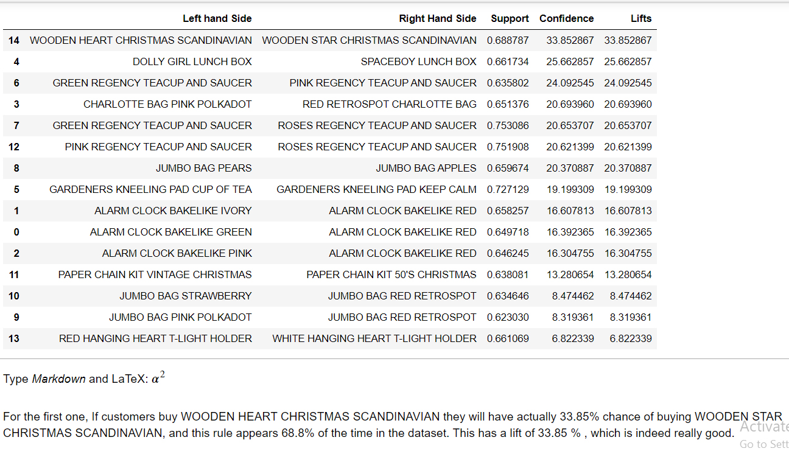

# Walmart Best Offer Prediction
#### Buy "This", Get "That" Free





## Overview
This is a transnational data set which contains all the transactions occurring between 01/12/2010 and 09/12/2011 for a UK-based and registered non-store online retail. This project focused on the Association rules to predict the best rules for Buy one, get one free offer. This project tries to find the best offer that will attract the customers more. The data can be found on Kaggle, to be exact : https://archive.ics.uci.edu/ml/datasets/online+retail


## Motivation

I was working on Machine learning models. Suddenly, I came to know about the Association rules on a udemy course. After learning the details about that , I found it interesting and wanted to create a mini project that will predict the best buy one get one free offer for supermarket.

## Installation
The Code is written in Python 3.7. If you don't have Python installed you can find it [here](https://www.python.org/downloads/). If you are using a lower version of Python you can upgrade using the pip package, ensuring you have the latest version of pip. To install the required packages and libraries, run this command in the project directory after [cloning](https://www.howtogeek.com/451360/how-to-clone-a-github-repository/) the repository:
```bash
pip install -r requirements.txt
```

## Tools
#### Environment
- Jupyter Notebook
#### Libraries
- Association rules(Apriori)
- Scikit - Learn
- Pandas
- Matplotlib
- Seaborn
## Directory Tree 
```
├── Buy THIS & Get THAT for free!!.ipynb
└── README.md
└── requirements.txt
└── result.jpg
```

## Bug / Feature Request
If you find a bug (the website couldn't handle the query and / or gave undesired results), kindly open an issue [here](https://github.com/AlJubaiarDE/Classification-Deep-learning-Vs-Machine-Learning/issues/new) by including your search query and the expected result.

If you'd like to request a new function, feel free to do so by opening an issue [here](https://github.com/AlJubaiarDE/Classification-Deep-learning-Vs-Machine-Learning/issues/new). Please include sample queries and their corresponding results.

## Team
|
-|
Al Jubaiar
## Credits
- [Udemy Machine Learning Course](https://www.udemy.com/course/machinelearning) - Helped me to learn Association rules practically .(Apriori, Eclat)
- [Krish Naik](https://www.youtube.com/user/krishnaik06) - Helped me to learn the intitution deeply.


